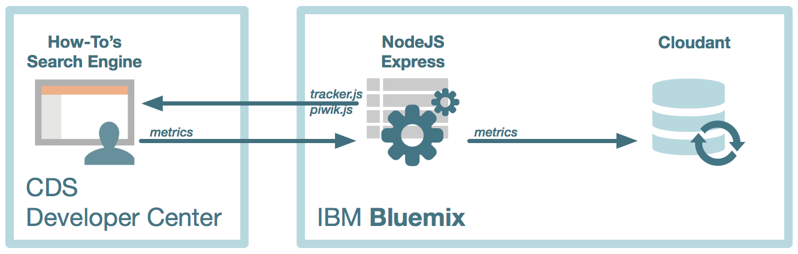
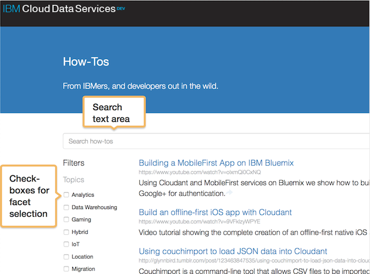

# Super Simple Metrics Tutorial
# Part 1: Metrics Collection

## Motivation
For those of you who follow the Cloudant blog, you recently read about [how to turn a spreadsheet into a faceted search engine](https://cloudant.com/blog/turning-a-spreadsheet-into-a-faceted-search-engine-with-cloudant/). As that article describes, the user interface to the search engine is a single-page web app. It takes the user’s search request, makes AJAX calls to the database and updates the web page with the results. This is a common technique for most modern, slick web UIs, but the problem is that to make the UI work more like an application and less like a web page, we update small parts of the page with search results instead of refreshing the entire page. This creates a challenge when we want to track usage of the application. What are users clicking on? What search requests are they generating? 

There are two basic ways to analyze a user’s behavior. Look at the web logs on the server side, or use other techniques to capture user behavior on the client. We can’t use the server-side strategy because we are treating the search engine as a micro-service that we don’t control, and more importantly, there may be user actions happening on the client-side that don't get captured in the HTTP requests that make it back to the server. So that leaves us with client-side techniques. There are a number of services that offer client-side behavior tracking, but for all their positives, some common drawbacks are that you don’t have full control over what you track, and usually the data is stored somewhere else. Your ability to control how your data is stored and what you can do with it is limited. 

You can find all the code for this part of the tutorial in the [metrics-collector GitHub repo](https://github.com/ibm-cds-labs/metrics-collector). 

## Overview

Here is an architural overview of what the metrics collector does. We have a web app in our Developer Center web site that is a client to our search engine, as mentioned earlier. We have a middleware component that serves the JavaScript files (`tracker.js` and `piwik.js`) that add metrics collection to the search engine client, and also accepts requests to save metrics data to the database. The database we use is [Cloudant](http://www.cloudant.com), a terrific NoSQL JSON document store. The middleware and the database run on [Bluemix](http://www.bluemix.net), IBM's innovative cloud platform-as-a-service. 



## Tracking user actions with Piwik

For these reasons, we decided to build our own application to track user behavior on our How-Tos page. We leverage the open source Piwik analytics library to capture search events generated in our web page. Piwik’s JavaScript tracking client offers the ability to capture a host of client-side information, from the basics such as page views and outbound link clicks, down to the most detailed user events. For our purposes, we focus on using Piwik to capture the user's search requests by listening to events on the the user interface elements that create the requests -- namely text area entries for full text search, and checkbox selections for facet search. 



Let's take a look at the JavaScript code that implements and extends Piwik to capture user events and sends them to the database. View the source of the [How-Tos page](https://developer.ibm.com/clouddataservices/how-tos/) and find the script tag include that reads like this: 

```html
  <script src="//metrics-collector.mybluemix.net/tracker.js" siteid="cds.search.engine"></script>
```
That's all we do in the HTML -- load the tracker.js script and pass it a single variable, `siteid`, which is a unique identifier that will be saved to the database with every event coming from the How-Tos page.

You can go to that URL to take a quick look at the JavaScript, or clone the [metrics-collector GitHub repo](https://github.com/ibm-cds-labs/metrics-collector) and pull it up in your favorite editor. Either way, let's take a quick read through of how event collecting works. First, we initialize Piwik's queue of events, which is simply an array: 

```javascript
  var _paq = _paq || [];
```

Then we write a function that loads piwik.js asynchronously, pushes some standard Piwik events onto the _paq queue, and also adds a custom function called `customDataFn` that saves the location, browser platform, and browser user agent to the event queue. You can dive deeper into implementing Piwik in their [JavaScript Tracking Client](http://developer.piwik.org/guides/tracking-javascript-guide) documentation. 

This file also contains the function `enableLinkTrackingForNode`, which enables event tracking for a DOM node. This is normally easier to do with Piwik, but since almost all of the HTML on our search page is generated programmatically (so that the user interface is not hard-coded to the facets, i.e. any change to the facets in the database will automatically be reflected in the UI) we have to programmatically attach link tracking to the relevant user interface elements when they are created. 

```javascript
var enableLinkTrackingForNode = function( node ){
  var _tracker = this;
  node.find('a,area').each(function(link){
	  _tracker.addClickListener($(this)[0], true);
  });
};
```

The function to do this is above, and to wire it up to our search engine, we needed to make the following small change to our search engine code to push that `enableLinkTrackingForNode` event onto the `_paq` queue for all DOM nodes that are children of the node whose ID is 'results'.

```javascript
  if ( typeof _paq !== 'undefined' ){
	  _paq.push([ enableLinkTrackingForNode, $('#results')]);
  }
```

> find this line of code in the file `cds.js` in the [search engine GitHub repo](http://ibm-cds-labs.github.io/devcenter-search-frontend/)

The end result of this client-side event tracking is that every user action on the search engine interface results in an event submission back to the tracker that looks something like this: 

**_Tracking payload URL submission_**
<pre>
https://metrics-collector.mybluemix.net/tracker?
   search=&search_cat=[{"key":"topic","value":"Data Warehousing"},
   {"key":"topic","value":"Hybrid"}]&
   search_count=2&
   idsite=cds.search.engine&
   rec=1&r=493261&h=17&m=46&s=48&
   url=https://developer.ibm.com/clouddataservices/how-tos/&
   _id=b0ffe9805ac2c6a9&
   _idts=1434658426&
   _idvc=52
   &_idn=0&
   _refts=1436995373&_viewts=1436985030&
   _ref=https://w3-connections.ibm.com/blogs/36ca03b2-48af-46e3-b50c-0f484d68a19c/entry/cds-dev-center?lang=en_us&send_image=0&
   pdf=0&
   qt=1&
   realp=0&
   wma=0&
   dir=0&
   fla=1&
   java=1&
   gears=0&
   ag=0&
   cookie=1&
   res=2880.0000858306885x1800.0000536441803&
   gt_ms=1179&
   uap=MacIntel&
   uag=Mozilla/5.0 (Macintosh; Intel Mac OS X 10.10; rv:31.0) Gecko/20100101 Firefox/31.0&
   date=2015-7-15
</pre>

Pretty cool so far. We've wired up our search engine with some custom event tracking. Now let's persist the data so we can do some usage analytics.

## Persisting usage data to Cloudant

We're going to use the Cloudant NoSQL database as the persistence engine for our event data. We do this for a few reasons. First, Cloudant stores it's data as JSON documents, which is a nice fit for the event data. Second, Cloudant emphasizes high availability, allowing for a high level of writes/second, which is important when you're storing so many fine-grained events like user clicks on a page.

So let's take that tracking payload from above and persist it to a Cloudant database. To do this we'll write a little NodeJS Express application that simply takes the tracking payload, transforms it into JSON, and writes it to Cloudant. Below is a sample JSON document showing what is sent Cloudant, which is also identical to Cloudant's native storage format. 

**_Data Model of the tracking payload_**

```json
{
  "type": "search",              //Type of event being captured (currently pageView, search and link)
  "idsite": "cds.search.engine", //app id (must be unique)
  "ip": "75.126.70.43",          //ip of the client
  "url": "http://cloudant-labs.github.io/resources.html",   //source url for the event
  "geo": {                       //geo coordinates of the client (if available)
    "lat": 42.3596328,
    "long": -71.0535177
  }
  "search": "",         //Search text if any (specific to search events)
  "search_cat": [       //Faceted search info (specific to search events)
    {
      "key": "topic",
      "value": "Analytics"
    },
    {
      "key": "topic",
      "value": "Data Warehousing"
    }
  ],
  "search_count": 7,    //search result count (specific to search events)
  "action_name": "IBM Cloud Data Services - Developers Center - Products", //Document title (specific to pageView events)
  "link": "https://developer.ibm.com/bluemix/2015/04/29/connecting-pouchdb-cloudant-ibm-bluemix/", //target url (specific to link events)
  "rec": 1,             //always 1
  "r": 297222,          //random string
  "date": "2015-5-4",    //event date time -yyyy-mm-dd
  "h": 16,              //event timestamp - hour
  "m": 20,              //event timestamp - minute
  "s": 10,              //event timestamp - seconds
  "$_id": "0e9dcf4b6b5b0dc7", //cookie visitor
  "$_idts": 1433860426,       //cookie visitor count
  "$_idvc": 2,          //Number of visits in the session
  "$_idn": 0,           //Whether a new visitor or not
  "$_refts": 0,         //Referral timestamp
  "$_viewts": 1433881201,  //Last Visit timestamp
  "$_ref": '',          //Referral url
  "send_image": 0,      //used image to send payload
  "uap": "MacIntel",     //client platform
  "uab": "Netscape",     //client browser
  "pdf": 1,             //browser feature: supports pdf
  "qt": 0,              //browser feature: supports quickTime
  "realp": 0,           //browser feature: supports real player
  "wma": 0,             //browser feature: supports windows media player
  "dir": 0,             //browser feature: supports director
  "fla": 1,             //browser feature: supports shockwave
  "java": 1,            //browser feature: supports java
  "gears": 0,           //browser feature: supports google gear
  "ag": 0,              //browser feature: supports silver light
  "cookie": 1,          //browser feature: has cookies
  "res": "3360x2100",   //browser feature: screen resolution
  "gt_ms": 51           //Config generation performance generation time
}
```

It was just mentioned that we're using a NodeJS Express app to accept requests to save tracking information for persisting to Cloudant. If you've been paying close attention you will also realize we're also using that same app to serve out the JavaScript files, `tracker.js` and `piwik.js` referenced earlier in the section on implementing Piwik. 

Let's take a quick look at our NodeJS Express app, `server.js` to see how this works. 

First, we load in required modules, including one called `cloudant` (loaded from the file `storage.js`) that simplifies the process of connecting to a Cloudant or CouchDB database (Cloudant is an extension of the CouchDB open source database). We initialize our database connection in the `trackerDb` variable initialization and add some secondary indices to it at the same time. 

Then, on line 66, we set up Express to serve out the static JavaScript files on this line, which makes any file in the `js` directory web-accessible via the url `http://metrics-collector.mybluemix.net/<filename>`.  


```javascript
   app.use(express.static(path.join(__dirname, 'js'))); 
```

The last component of the app serves to accept event tracking data on the `/tracker` endpoint. In `app.get("/tracker"...` we take the request and use [lodash](https://lodash.com/) to construct the JavaScript "tracking payload" object shown earlier. Finally, we add the client's IP address to the payload and then persist it to the server.

## Summary of metrics collection
We've now built a data warehouse of user events for our web page, which happens to be a search engine. Note that this could have been any type of web app upon which you want to track usage patterns. Also note that this doesn't have to be metrics for a single web app or page. Remember the first thing we did was to include a reference to the `tracker.js` script and pass it a siteid variable? 

```html
  <script src="//metrics-collector.mybluemix.net/tracker.js" siteid="cds.search.engine"></script>
```

The "application" is identified by the siteid, so if you use the same siteid on different web pages, their metrics will be grouped and analyzed together (you will still be able to identify the different web pages via the `trackPageView` Piwik event that's being tracked, and shows up in the database as the `url` key). 

